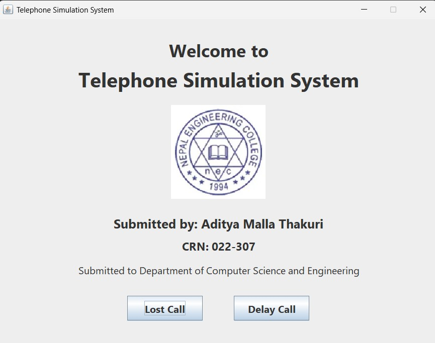
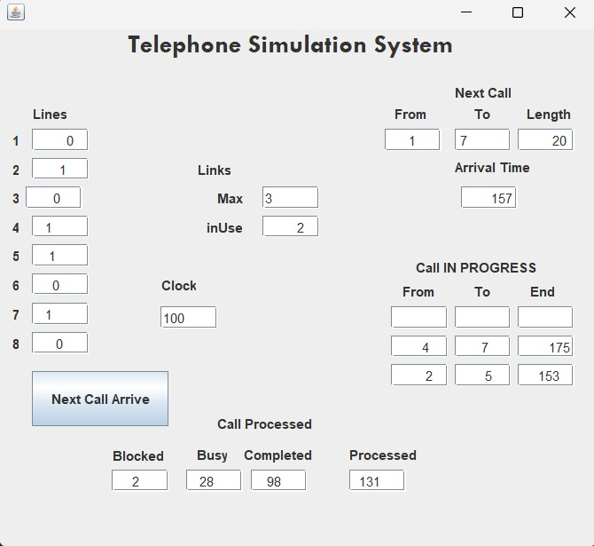
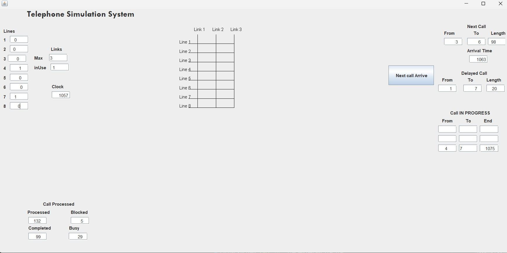

# 📞 Telephone Simulation System

A Java GUI application that simulates telephone switching operations using **Erlang-B** (Lost Call) and **Erlang-C** (Delay Call) models. Features real-time visualization, professional statistics, and enhanced queue management.



## ✨ Features

- 🎯 **Two Simulation Modes**: Lost Call (Erlang-B) & Delay Call (Erlang-C)
- 📊 **Real-time Statistics**: Professional KPIs with Ctrl+Click for detailed metrics
- 🎨 **Visual Simulation**: Color-coded connections and queue monitoring
- ⚡ **Event-Driven Architecture**: Proper FIFO queue management
- 📱 **Modern GUI**: Logo support and enhanced input validation

## � Quick Start

### Prerequisites
- Java JDK 8+
- Windows/macOS/Linux with GUI support

### Installation & Run
```bash
# Compile
javac -cp . *.java

# Create package structure
mkdir -p com/mycompany/tsm
move *.class com/mycompany/tsm/

# Run
java -cp . com.mycompany.tsm.Tsm
```

## 📊 Simulation Modes

### Lost Call Simulation (Erlang-B)
Simulates systems where blocked calls are lost. Perfect for understanding blocking probability and system capacity.



**Key Features:**
- Real-time blocking probability calculation
- Visual connection display with color coding
- Professional statistics (Ctrl+Click for details)

### Delay Call Simulation (Erlang-C)  
Simulates systems with call queuing. Demonstrates proper FIFO queue management and wait time analysis.



**Key Features:**
- Unlimited queue capacity with FIFO processing
- Event-driven architecture for realistic behavior
- Wait time statistics and queue performance metrics

## 🎯 How to Use

1. **Run the application**: `java -cp . com.mycompany.tsm.Tsm`
2. **Choose simulation mode** from the welcome screen
3. **Enter parameters**:
   - From Line (1-8)
   - To Line (1-8) 
   - Call Length
   - Arrival Time
4. **Click "Simulate"** to run
5. **Hold Ctrl+Click** for detailed statistics

## 🔧 Technical Highlights

- **Event-Driven Architecture**: Uses `PriorityQueue<Event>` for chronological processing
- **FIFO Queue Management**: `ArrayList<QueuedCall>` for proper call queuing
- **Professional Statistics**: Real-time KPIs with Erlang-B/C calculations
- **Enhanced GUI**: Logo support, input validation, and modern layout

## 🛠️ Quick Troubleshooting

**Class not found error?**
```bash
mkdir -p com/mycompany/tsm
move *.class com/mycompany/tsm/
```

**Images not showing?** Ensure `output1.jpg`, `lostcall.jpg`, and `delayedcall.jpg` are in the project root.
